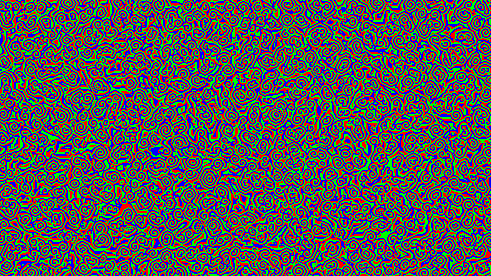

# ow my eyes
My first foray into GPU programming. (Now [on the web!](https://owmyeyes.wackery.com/))



# Running

## Requirements
* Rust
* pnpm (when building for web)
* wasm32-unknown-unknown target (when building for web)


## Running locally
Either download a binary, or run from source:
```
cargo run --release
```

## Running on web

```
pnpm i
pnpm build
```
Static site is in `dist/`

## Controls
* Click to fullscreen
* Left/Right Arrow Keys to switch color mode
* P to enable "Psychedelic Mode" (Will hurt your eyes)
* R to reset
* Escape to exit (native only)

## Story
I got [this very great video](https://www.youtube.com/watch?v=TvZI6Xc0J1Y) in my youtube recommendations, and decided to re-implement it in Rust with a 1920x1080 grid. It ran entirely on the cpu with multithreading. Needless to say, it maxed my CPU to death. Sent it to a friend with a 24 core i9-13980HX, maxed his CPU too. Only way I could get it running at 60fps was to run at half resolution and scale up. Knowing this wasn't the way, I decided to learn wgpu and rewrite the code to mostly run on the GPU, which is what this is.

## Explanation (Rules)
Each pixel in the 1920x1080 grid represents either rock (red), paper (green) or scissors (blue). Every tick, (60 times a second), each pixel counts how many of its neighbors "beat" it. (Rock for scissors, Paper for rock, Scissors for paper). If more then two neigbors beat the current pixel, the current pixel becomes it.

## Explanation (Shader/Technical)
The code uses two buffers, input and output.
### Compute
1. Copy output to input. In the cpu code, we didn't have to do this because we completely recreated the buffer instead of mutating it. We need to copy here so we dont end up modifying the buffer we are reading from while we are reading from it (bad)
2. The compute shader runs with 16x9x1 threads, and is dispatched with 120x120x1 workgroups. (this ends up being 1920x1080x1 threads). Each thread is responsible for one pixel. (this is probably the place to optimize the most). The thread updates the pixel in the output, and returns.
3. Wait until the compute shader finishes

### Render
The render pass is pretty simple.
1. The vertex shader simply renders the whole screen.
2. The fragement shader reads from output and uses that to determine the color of every pixel.
3. We draw to the swapchain texture.

## Thanks
* [This wgpu tutorial](https://sotrh.github.io/learn-wgpu/) was a great help in getting started with wgpu. (A lot of copy paste for the boilerplate)